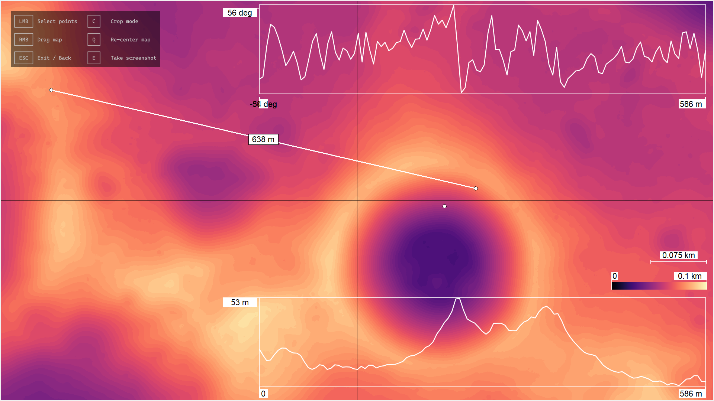

# Lunar Heightmap Calculator




[](https://github.com/unconsciou5/Lunar_Heightmap_Calculator/releases/latest/download/Lunar_Heightmap_Calculator.exe)


This tool was written for Lunar Hightmaps from Lunar Orbiter Laser Altimeter (LOLA) http://imbrium.mit.edu/

**Features**
* surface-distance calculation
* air-distance calculation
* height profile plotting
* heightmap contrast colouring
* map downloader

**Run executable**
```
run Lunar_Heightmap_Calculator.exe        
  -> select a Lunar heightmap to download, convert and display
```

**Controls**
```
Left Click            Select Points: 1) -> 2) -> Distance
Right Click Drag      Moving over map
ESC                   Exit
C                     Crop mode
Q                     Re-center map
E                     Take screenshot
```

**Run from source**
```
install requirements.txt |  pip install -r .\requirements.txt
run engine.py         -> select a Lunar height map to automatically download, convert and display
                      -> analyse and measure on heightmap
```
**Build from source**
```
auto-py-to-exe        GUI for pyinstaller
```
